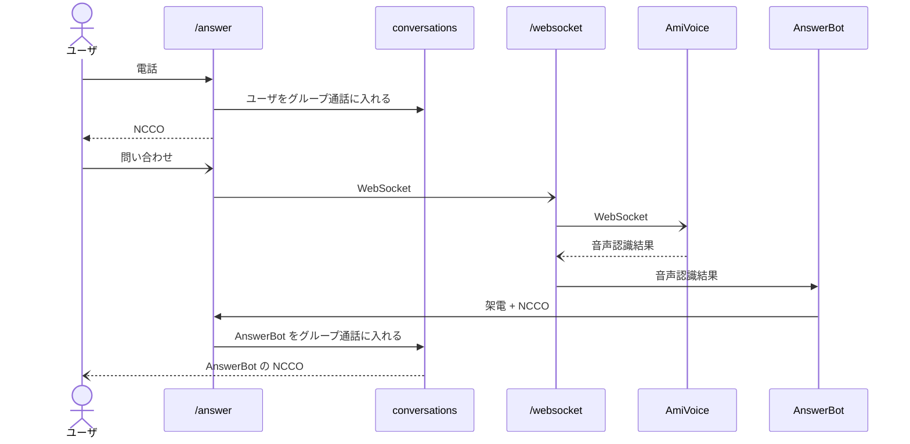

# Vonage と AmiVoice の WebSocket 連携

## 概要

ユーザが発声した内容を AmiVoice が音声認識して、OpenAI が回答を返します。



## 設定

1. AmiVoice のアカウント取得
   1. <https://acp.amivoice.com/amivoice_api/>
1. Vonage でアプリケーション ID と秘密鍵の取得
    1. [Vonage Voice API ガイド](https://zenn.dev/kwcplus/articles/vonage-voice-guide)
    1. 秘密鍵（private.key）をフォルダ内に配置
1. OpenAI の API キー取得
    1. <https://platform.openai.com/docs/quickstart>
1. npm install
1. npm run start
1. ngrok http 3000
1. ngrok の URL をコピー
1. cp .env.example .env
1. .env を設定
1. .env を読み込むために npm run start を C-c で終了させ、再度 npm run start
1. 回答 URL に ``ngrok の URL/answer`` を設定
1. イベント URL に ``ngrok の URL/event`` を設定
1. 電話をしてAIによる回答が戻って来ることを確認

## conversation とは

conversation は Vonage によるグループ通話機能。1 ～ 50 人が参加可能。途中参加も可能。

そのため、AmiVoice の音声認識結果をトリガーに、AnswerBot が conversation に一時期に参加し、伝えた後に抜ける（秒課金）。

<https://developer.vonage.com/en/voice/voice-api/ncco-reference#conversation>

## AnswerBot

```js
const answerBot = async (text) => {
  // OpenAI の script を使って回答する
  const answer = await answerOpenAiBot(text);

  // https://developer.vonage.com/en/voice/voice-api/ncco-reference?source=voice
  const ncco = [{
    action: "talk",
    language: "ja-JP",
    style: 3,
    premium: true,
    text: answer,
  }];

  // https://developer.vonage.com/en/voice/voice-api/code-snippets/making-calls/make-an-outbound-call-with-ncco?source=voice&lang=javascript
  vonage.voice.createOutboundCall({
    ncco: ncco,
    to: [{
      type: 'phone',
      number: process.env.VONAGE_NUMBER,
    }],
    from: {
      type: 'phone',
      number: process.env.VONAGE_NUMBER,
    },
    eventUrl: [`https://${SERVER}/answerBot/event`],
  })
    .then((result) => console.log(result))
    .catch((error) => console.error(error));
};
```

## 注意点

### enabledAmiVoice

「こんにちは」とユーザが発声すると、AmiVoice は音声認識結果を AnswerBot に渡す。

AnswerBot が「こんにちは」と読み上げると、それを AmiVoice がまた拾って AnswerBot に渡す。これにより無限ループになる。

無限ループにならないように、AnswerBot が読み上げるときは AmiVoice を一時的にオフにする。

```js
          enabledAmiVoice = false
          console.log("disabled to AmiVoice")

          answerBot(data.text)
```

AnswerBot の発声が終わると completed が渡されるため、AmiVoice を再開する。

```js
app.post("/answerBot/event", (req, res) => {
  if (req.body.status === "completed") {
    enabledAmiVoice = true;
    console.log("enabled to AmiVoice")
  }
  res.status(200).end();
});
```

enabledAmiVoice が false なら AmiVoice に渡さない。

```js
  ws.on("message", (message) => {
    if (wsAmiVoiceOpened && enabledAmiVoice) {
      const pBuffer = Buffer.from("p");
      const audioBuffer = Buffer.from(message, "base64");
      wsAmiVoice.send(Buffer.concat([pBuffer, audioBuffer]));
    }
  });
```

### CONVERSATION_NAME

現在は固定のため、みんなが同じ「部屋」になる。

この CONVERSATION_NAME を、回答 URL 時に渡される uuid などのユニークな値にすることで、専用の「部屋」になる。

同じ電話番号でも、conversation の name が別であれば、別の「部屋」になる。

複数の CONVERSATION_NAME を扱うには DB が必要なため割愛。

### From が t\d+ になる

本来、電話番号の 8150\d のはずが t\d+ になる。これは Vonage 社と調査中。

```js
const isAnswerBot = (from) => {
  req.query.from === process.env.VONAGE_NUMBER || req.query.from.startsWith("t")
}
```
